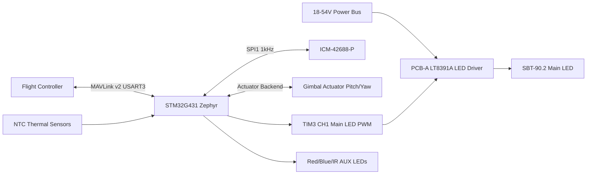

# SGL-200 Architecture

This is the canonical architecture summary for AI agents. Detailed Mermaid diagram sources live in `architecture/`; the original Mermaid source references remain legacy source-import material.

## System Overview

SGL-200 is a drone payload with two boards:

- PCB-A Power Board: input protection, LC filter, LT8391A 4-switch buck-boost LED driver, MOSFET power stage, current sense, main LED output, and inter-board power/control connector.
- PCB-B Control Board: STM32G431CBU6, ICM-42688-P IMU, 5V buck, 3.3V LDO, MAVLink interface, gimbal actuator interface, debug, ADC thermal monitoring, and AUX LED GPIO.

External connections:

- Drone power bus: 18-54V DC.
- Flight controller: MAVLink v2 over USART3 at 921600bps.
- RC/PWM fallback: 1000-2000us PWM dim input when supported by the hardware revision.
- Ground station: Mission Planner or QGroundControl through the flight controller telemetry link.

## Hardware Blocks

| Block | Responsibility | Key constraints |
|---|---|---|
| LT8391A LED driver | 36V, 3A constant-current main LED drive | 600kHz minimum switching, 108W target output |
| Main LED | White spotlight output | SBT-90.2 Gen3 CW 5600K, >= 8000lm target |
| STM32G431CBU6 | Real-time control and communication | 170MHz, Zephyr RTOS, CORDIC available |
| ICM-42688-P | IMU feedback | SPI1 Mode 3, 24MHz max, 1kHz ODR |
| Gimbal actuator | Pitch and yaw actuation | v1 servo bus uses ST3215HS over USART2 half-duplex, 1Mbps, ID 1/2; servo PWM uses TIM4_CH1 PB6 and TIM4_CH2 PB7; future variants may use BLDC |
| Thermal sensing | LED and driver temperature protection | ADC NTC, throttle at 75C, shutdown at 95C |
| MAVLink interface | FC and GCS integration | GIMBAL_DEVICE component, not GIMBAL_MANAGER |

## Target Project Structure

The workspace currently contains documentation. When implementation begins, use this target structure:

```text
firmware/
  boards/arm/sgl200_v1/
  dts/bindings/
  drivers/icm42688/
  drivers/feetech/
  drivers/lt8391a/
  lib/madgwick/
  lib/pid/
  app/gimbal/
  app/led/
  app/mavlink/
  app/thermal/
  app/safety/
  tests/
hardware/
  pcb-a-power/
  pcb-b-control/
test/
  dvp/
  field/
tools/
  scripts/
  configs/
```

## Firmware Layers

1. Drivers
   - ICM-42688-P SPI driver.
   - Feetech ST3215HS half-duplex UART driver for the v1 servo bus actuator variant.
   - LT8391A PWM/enable/fault control.
   - ADC NTC thermal input.

2. Algorithms
   - Madgwick AHRS at 1kHz.
   - STM32G431 CORDIC wrapper for trigonometric acceleration where useful.
   - Generic PID with back-calculation anti-windup.

3. Application
   - Gimbal control modes, cascaded PID, and actuator backend abstraction.
   - LED manager FSM and strobe patterns.
   - MAVLink agent and parameter system.
   - Thermal monitor and safety manager.

4. Platform services
   - Zephyr threads, IPC, logging, NVS, watchdog, RTT, and SystemView.

## Thread And IPC Model

| Thread | Priority | Timing | Inputs | Outputs |
|---|---:|---|---|---|
| `imu_thread` | 0 | 1ms IRQ | IMU data-ready semaphore | Quaternion, Euler attitude, gyro rates |
| `control_thread` | 1 | 1ms | Rate setpoints, gyro rates | Actuator commands |
| `angle_thread` | 2 | 5ms | Gimbal setpoint, attitude | Pitch/yaw rate setpoints |
| `mavlink_rx_thread` | 3 | async | UART DMA RX | Command queues, parameters, setpoints |
| `mavlink_tx_thread` | 4 | 250ms | Attitude, fault queue, ACK queue | MAVLink TX frames |
| `led_manager_thread` | 5 | 10ms | LED command queue, thermal state | PWM/GPIO outputs |
| `thermal_thread` | 6 | 100ms | ADC NTC samples | Temperature state, thermal faults |
| `watchdog_thread` | 7 | 400ms | Heartbeat timestamp, thread health | IWDG feed, safe-state trigger |

IPC rules:

- IMU data-ready uses `k_sem`.
- LED commands use `k_msgq`.
- Fault reporting uses `k_msgq`.
- Gimbal setpoint and heartbeat timestamps use atomics or protected shared state.
- Avoid raw globals for cross-thread mutable state.

## Gimbal Control

Modes:

- `GIMBAL_STABILIZE`: hold absolute pitch/yaw relative to earth frame.
- `GIMBAL_FOLLOW`: yaw follows drone heading while pitch remains stabilized.
- `GIMBAL_ROI`: compute pitch/yaw from target GPS coordinate.
- `GIMBAL_LOCK`: hold current angle and ignore FC movement commands.
- `GIMBAL_NEUTRAL`: return to 0deg pitch and 0deg yaw, disable active tracking.

Initial gains:

| Axis | Loop | Kp | Ki | Kd |
|---|---|---:|---:|---:|
| Pitch | Angle | 8.0 | 0.5 | 0.1 |
| Pitch | Rate | 0.8 | 0.02 | 0.005 |
| Yaw | Angle | 6.0 | 0.3 | 0.08 |
| Yaw | Rate | 0.6 | 0.015 | 0.003 |

Control limits:

- Outer loop period: 5ms, 200Hz.
- Inner loop period: 1ms, 1kHz.
- Rate setpoint limit: +/-500deg/s.
- Pitch mechanical/command range: -90deg to +30deg.
- Yaw mechanical/command range: -160deg to +160deg.
- Product variants select the actuator backend through Kconfig and product overlays.

## LED Manager

States:

- `LED_IDLE`
- `LED_SOFT_START`
- `LED_NORMAL`
- `LED_STROBE_WHITE`
- `LED_STROBE_POLICE`
- `LED_STROBE_SOS`
- `LED_THERMAL_THROTTLE`
- `LED_EMERGENCY_OFF`

Behavior:

- Main LED is dimmed through Zephyr PWM API at 20kHz.
- Soft-start ramps from 0 to target brightness in 500ms.
- White strobe toggles main LED at 1Hz.
- Police strobe alternates red and blue every 250ms.
- SOS strobe uses Morse timing: dot 200ms, dash 600ms, symbol gap 200ms, word gap 1400ms.
- Thermal throttle starts above 75C, reducing brightness by 10% per degree C down to 20% minimum.
- Emergency off at > 95C cuts PWM immediately and requires manual reboot/recovery policy.

## MAVLink Flow

SGL-200 is the MAVLink GIMBAL_DEVICE component.

Transmit:

- `HEARTBEAT` at 1Hz.
- `GIMBAL_DEVICE_INFORMATION` on request.
- `GIMBAL_DEVICE_ATTITUDE_STATUS` at 4Hz.
- `COMMAND_ACK` for accepted/rejected commands.
- `PARAM_VALUE` for parameter read/write responses.
- `STATUSTEXT` for faults.

Receive:

- FC `HEARTBEAT` for system ID, arming state, and link freshness.
- `GIMBAL_DEVICE_SET_ATTITUDE` for gimbal commands.
- `COMMAND_LONG` with `MAV_CMD_DO_SET_RELAY` for LED/strobe control.
- `COMMAND_LONG` with `MAV_CMD_DO_CONTROL_VIDEO` for brightness control.
- `PARAM_SET` and parameter requests.

Safety:

- FC disarmed means LED off immediately.
- MAVLink heartbeat timeout > 3000ms triggers safe state.
- Safe state sets gimbal neutral and LED brightness to 50%, then reports fault.

## Bring-Up Sequence

1. Verify 5V buck and 3.3V LDO rails.
2. Boot STM32G431 and configure clock to 170MHz.
3. Initialize GPIO, SPI1 DMA, USART2/3, PWM, ADC, and watchdog.
4. Initialize ICM-42688-P and confirm WHO_AM_I `0x47`.
5. Initialize the selected gimbal actuator backend, then move pitch and yaw to home position.
6. Keep LT8391A disabled until LED manager is ready.
7. Start MAVLink HEARTBEAT and wait for FC heartbeat.
8. Enter ready state or standalone/fallback state depending on link detection.

## Architecture Diagrams

The canonical Mermaid diagram library is in [`architecture/README.md`](architecture/README.md).

Current diagram set:

- [`architecture/system-overview.md`](architecture/system-overview.md) - high-level hardware, firmware, power, and external integration flow.
- [`architecture/thread-data-flow.md`](architecture/thread-data-flow.md) - Zephyr threads, IPC primitives, and runtime data movement.
- [`architecture/led-state-machine.md`](architecture/led-state-machine.md) - LED manager states and thermal safety transitions.
- [`architecture/gimbal-control-flow.md`](architecture/gimbal-control-flow.md) - command intake through cascaded gimbal control and actuator output.
- [`architecture/mavlink-message-flow.md`](architecture/mavlink-message-flow.md) - FC/GCS MAVLink RX/TX interaction flow.
- [`architecture/core-data-structure.md`](architecture/core-data-structure.md) - main runtime data structures and ownership relationships.

Short embedded snapshot:


