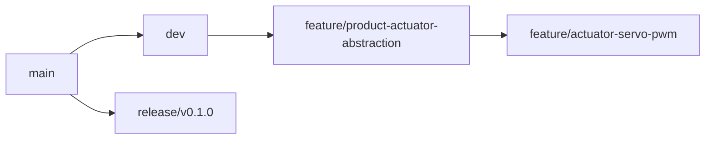

# Branch Map

This document records the current branch strategy and the responsibility of each generated branch.

## Rule

Each product branch owns the hardware scaffold for its actuator product only. For example, `feature/actuator-servo-pwm` contains Servo PWM hardware and must not contain Servo Bus or BLDC hardware implementation folders.

## Long-Lived Branches

| Branch | Purpose | Merge policy |
|---|---|---|
| `main` | Stable baseline for reviewed milestones | Receives release merges only |
| `dev` | Integration branch for active development | Feature branches merge here after review |
| `release/v0.1.0` | Initial release preparation branch | Accepts only release stabilization changes |

## Feature Branches

| Branch | Firmware function | Hardware scope | Status |
|---|---|---|---|
| `feature/product-actuator-abstraction` | Adds common gimbal actuator abstraction, product variant configs, Kconfig backend choice, and architecture updates | No product-specific hardware implementation required beyond shared docs | Pushed; should merge to `dev` before actuator-specific branches are merged |
| `feature/actuator-servo-pwm` | Implements Servo PWM backend using TIM4_CH1 PB6 for pitch and TIM4_CH2 PB7 for yaw | Servo PWM hardware only; USART2 servo bus is disabled by overlay and no BLDC hardware is implemented | Pushed; depends on `feature/product-actuator-abstraction` |

## Branch Dependency Graph

## Recommended Merge Order

1. Merge `feature/product-actuator-abstraction` into `dev`.
2. Rebase or update `feature/actuator-servo-pwm` on the updated `dev`.
3. Merge `feature/actuator-servo-pwm` into `dev`.
4. Create future actuator branches from `dev` after abstraction is merged.

## Future Branches

| Branch | Purpose |
|---|---|
| `feature/actuator-servo-bus` | Implement servo-bus product hardware and firmware hardening without Servo PWM hardware folders |
| `feature/actuator-bldc` | Implement BLDC backend and BLDC hardware scaffold once transport, feedback, enable, and fault pins are defined |
| `feature/product-build-matrix` | Add CI or scripts that build each product config/overlay combination |
| `docs/architecture-source-map` | Documentation-only updates to architecture and source maps |
