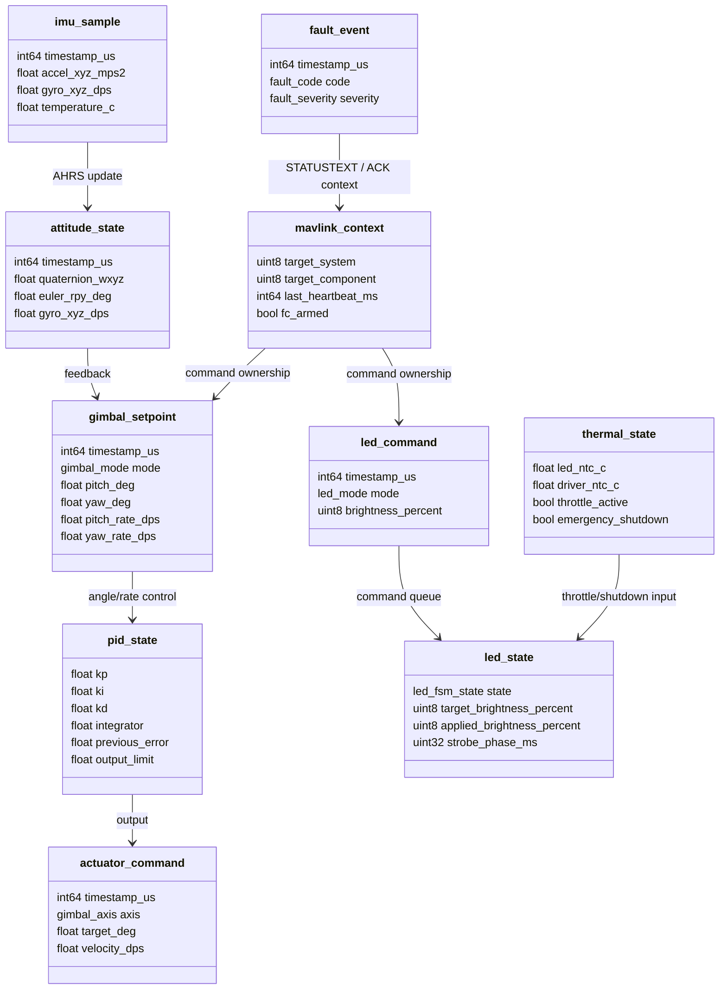

# Core Data Structure

This diagram shows the main runtime data structures and ownership relationships.

```mermaid
classDiagram
    class imu_sample {
        int64 timestamp_us
        float accel_xyz_mps2
        float gyro_xyz_dps
        float temperature_c
    }

    class attitude_state {
        int64 timestamp_us
        float quaternion_wxyz
        float euler_rpy_deg
        float gyro_xyz_dps
    }

    class gimbal_setpoint {
        int64 timestamp_us
        gimbal_mode mode
        float pitch_deg
        float yaw_deg
        float pitch_rate_dps
        float yaw_rate_dps
    }

    class pid_state {
        float kp
        float ki
        float kd
        float integrator
        float previous_error
        float output_limit
    }

    class actuator_command {
        int64 timestamp_us
        gimbal_axis axis
        float target_deg
        float velocity_dps
    }

    class led_command {
        int64 timestamp_us
        led_mode mode
        uint8 brightness_percent
    }

    class led_state {
        led_fsm_state state
        uint8 target_brightness_percent
        uint8 applied_brightness_percent
        uint32 strobe_phase_ms
    }

    class thermal_state {
        float led_ntc_c
        float driver_ntc_c
        bool throttle_active
        bool emergency_shutdown
    }

    class mavlink_context {
        uint8 target_system
        uint8 target_component
        int64 last_heartbeat_ms
        bool fc_armed
    }

    class fault_event {
        int64 timestamp_us
        fault_code code
        fault_severity severity
    }

    imu_sample --> attitude_state : AHRS update
    attitude_state --> gimbal_setpoint : feedback
    gimbal_setpoint --> pid_state : angle/rate control
    pid_state --> actuator_command : output

    led_command --> led_state : command queue
    thermal_state --> led_state : throttle/shutdown input

    mavlink_context --> gimbal_setpoint : command ownership
    mavlink_context --> led_command : command ownership
    fault_event --> mavlink_context : STATUSTEXT / ACK context
```

Notes: Field names are architecture-level contracts, not final C type definitions.
