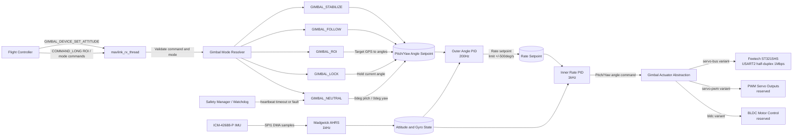

# Gimbal Control Flow

This diagram shows command intake through the cascaded gimbal control loops and actuator output path.

Notes: Pitch command range is -90deg to +30deg; yaw command range is -160deg to +160deg.
