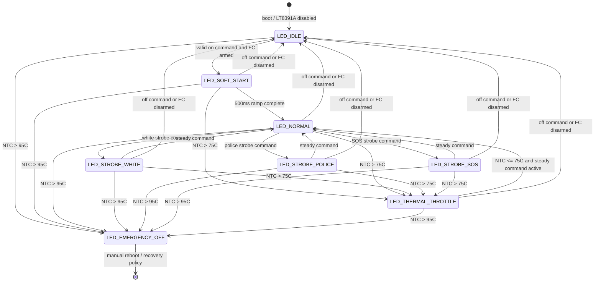

# LED State Machine

This diagram shows the LED manager states, command transitions, thermal throttle, and emergency shutdown behavior.

Notes: Thermal throttle reduces brightness by 10% per degree C down to a 20% minimum. Emergency off cuts PWM immediately.
