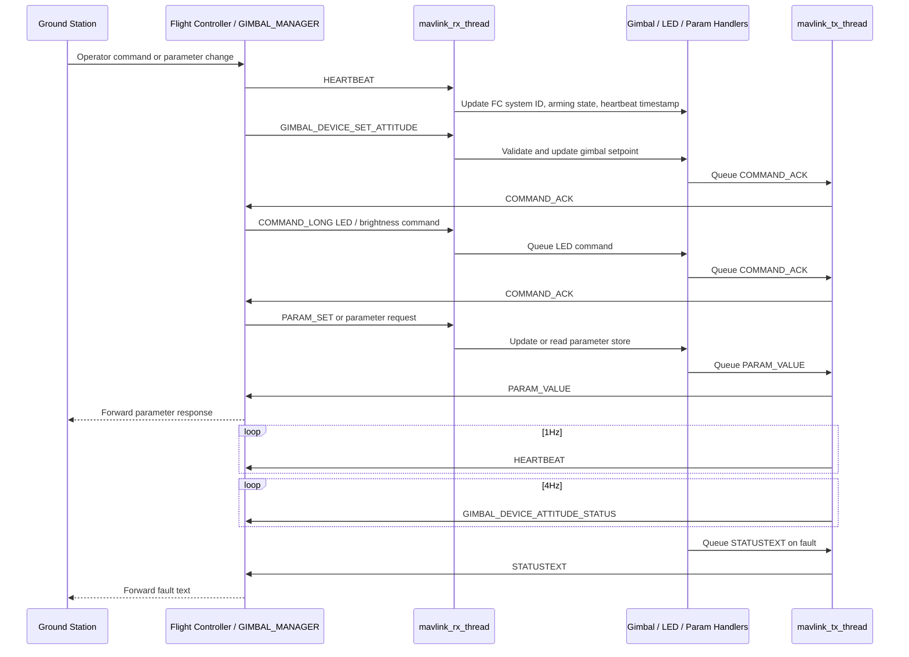

# MAVLink Message Flow

This diagram shows SGL-200 interactions with the flight controller and ground station over MAVLink.

Notes: MAVLink heartbeat timeout greater than 3000ms triggers safe state.
