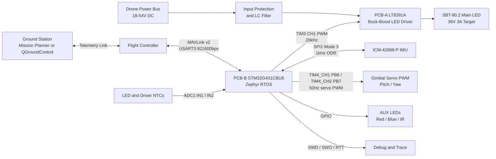

# System Overview

This diagram shows the high-level SGL-200 hardware, firmware, power, and external integration flow.

Notes: SGL-200 implements MAVLink `GIMBAL_DEVICE`; the flight controller remains the `GIMBAL_MANAGER`.
