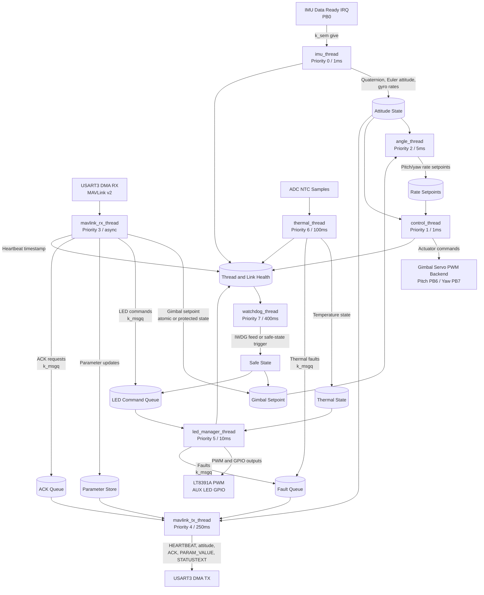

# Thread Data Flow

This diagram shows the Zephyr thread model, IPC primitives, and main runtime data movement.

Notes: Cross-thread mutable state should use Zephyr IPC, atomics, or protected shared state.
